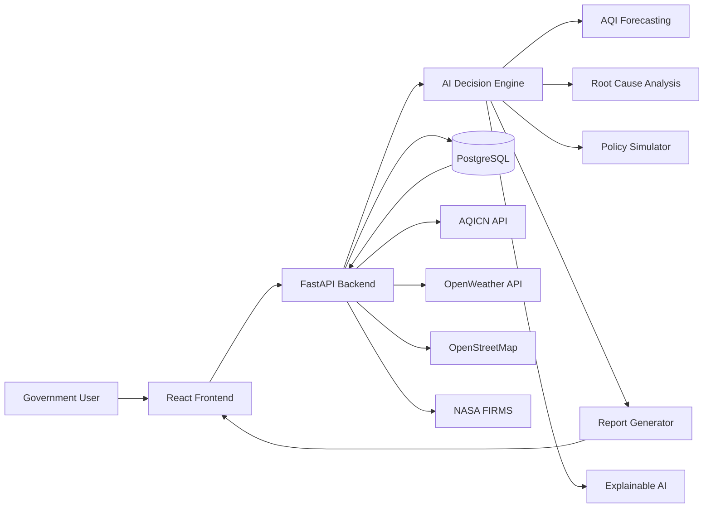
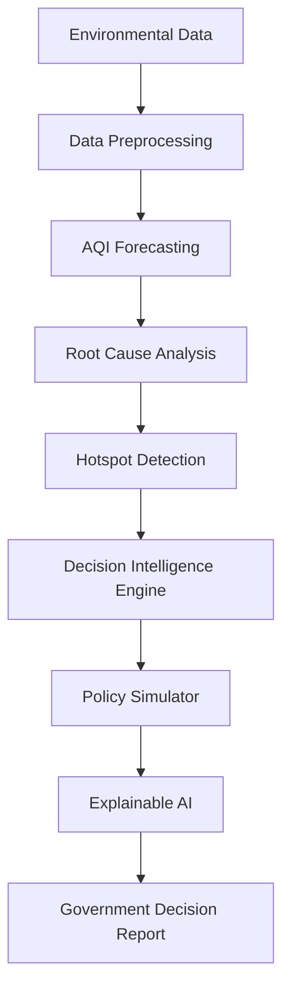
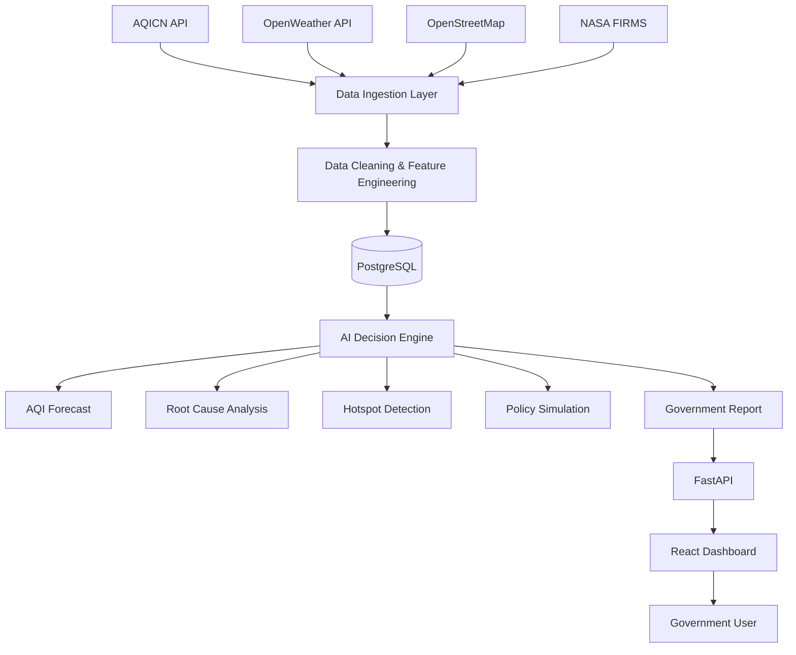
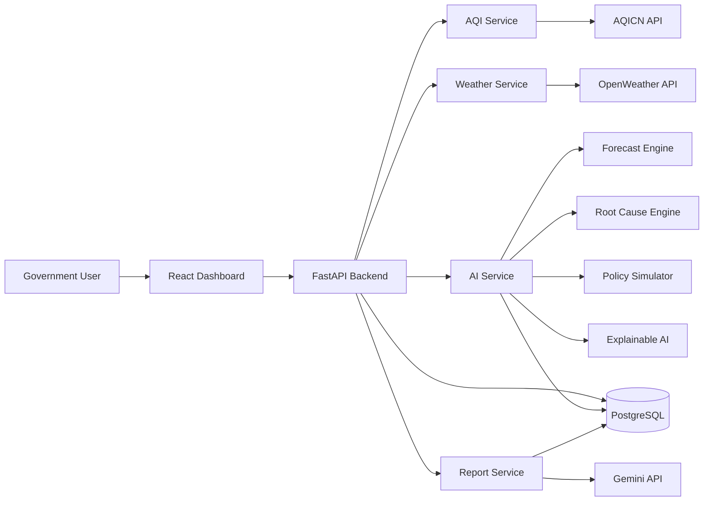
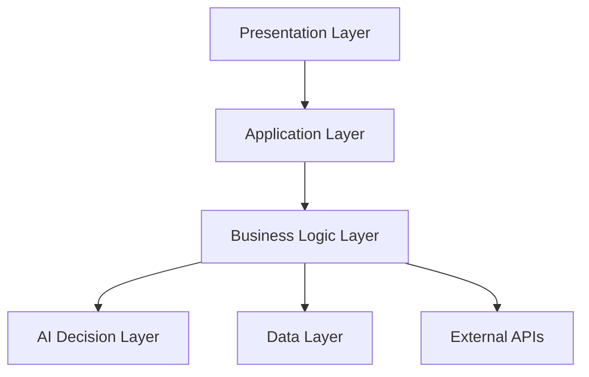
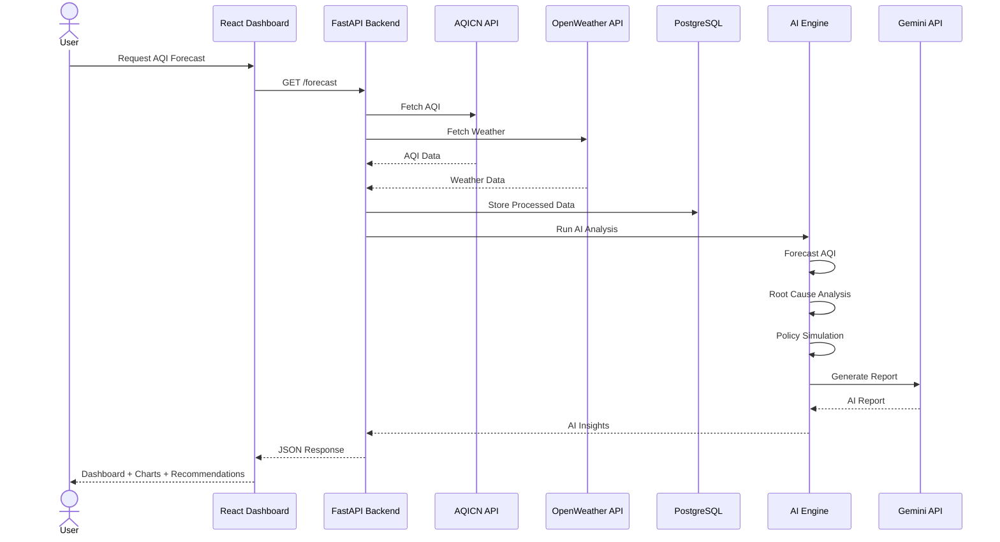
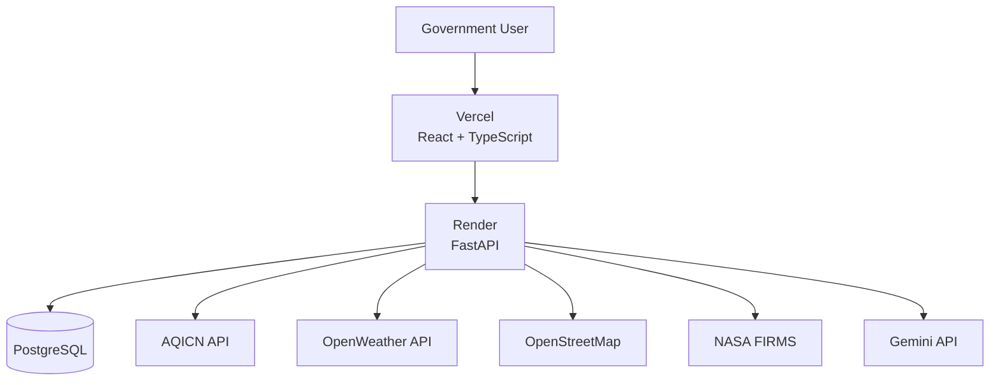

# Project AERIS

# System Architecture

## Objective

This document defines the overall system architecture of AERIS, including its major components, data flow, AI pipeline, external integrations, deployment strategy, and scalability considerations.

The goal is to design a modular, scalable, and AI-first architecture that can evolve from a hackathon prototype into a production-ready Urban Decision Intelligence Platform.

---

# Architecture Principles

AERIS is designed around the following engineering principles:

- Modular Architecture
- AI-First Design
- API-Driven Communication
- Explainable AI
- Scalable Components
- Separation of Concerns
- Human-in-the-Loop Decision Making

---

# System Overview

AERIS consists of six major layers:

1. User Interface Layer
2. Backend API Layer
3. AI Decision Intelligence Engine
4. External Data Sources
5. Database Layer
6. Reporting & Visualization Layer

Each layer has a well-defined responsibility, making the system easy to maintain, extend, and scale.

---

# High-Level Workflow

Environmental Data

↓

Backend Services

↓

AI Decision Engine

↓

Decision Intelligence

↓

Government Dashboard

↓

Human Decision

↓

Field Action

↓

Monitoring & Feedback


---

# High-Level System Architecture



---

# Architecture Layers

## 1. Presentation Layer

The frontend provides an interactive dashboard for government authorities.

Responsibilities:

- AQI Dashboard
- Heatmaps
- Forecast Visualization
- Policy Simulation
- AI Reports

Technology:

- React
- TypeScript
- Tailwind CSS
- Leaflet Maps

---

## 2. Backend Layer

Acts as the central coordinator of the system.

Responsibilities:

- API Management
- Data Processing
- AI Orchestration
- Database Operations
- External API Integration

Technology:

- FastAPI
- Python
- SQLAlchemy

---

## 3. AI Decision Intelligence Layer

The intelligence core of AERIS.

Responsibilities:

- AQI Forecasting
- Root Cause Analysis
- Decision Recommendations
- Policy Simulation
- Explainable AI
- Government Report Generation

Technology:

- XGBoost
- LightGBM
- SHAP
- Gemini API

---

## 4. Data Layer

Stores processed information and generated reports.

Responsibilities:

- AQI History
- Forecast Results
- Reports
- Logs
- Cached Data

Technology:

- PostgreSQL

---

## 5. External Services

Provides real-time environmental information.

Integrated APIs:

- AQICN
- OpenWeather
- OpenStreetMap
- NASA FIRMS


---

# AI Decision Intelligence Engine

The AI Decision Intelligence Engine is the core component of AERIS. It transforms raw environmental data into explainable recommendations for government decision-makers.



---

# AI Modules

## 1. Data Preprocessing

### Responsibilities

- Collect data from APIs
- Handle missing values
- Normalize environmental data
- Feature Engineering

Input

- AQI
- Weather
- Population
- Location

Output

- Clean Feature Set

---

## 2. AQI Forecasting Engine

### Responsibilities

Predict future AQI values.

Input

- Historical AQI
- Weather

Output

- Next 24-Hour AQI
- Confidence Score

AI Models

- XGBoost
- LightGBM

---

## 3. Root Cause Analysis Engine

### Responsibilities

Estimate the probable contributors behind poor air quality.

Input

- Forecast
- Weather
- Fire Hotspots
- Population Density

Output

- Possible Pollution Sources
- Contribution Percentage

---

## 4. Hotspot Detection Engine

### Responsibilities

Identify high-risk locations requiring immediate attention.

Output

- Ward-wise Heatmap
- Priority Zones

---

## 5. Decision Intelligence Engine

### Responsibilities

Recommend actions based on environmental conditions.

Example Recommendations

- Restrict Heavy Vehicles
- Suspend Construction
- Increase Water Sprinkling
- Issue Health Advisory

Each recommendation includes:

- Priority
- Confidence
- Expected Impact

---

## 6. Policy Simulation Engine

### Responsibilities

Estimate the impact of proposed government actions.

Examples

- Traffic Reduction
- Construction Ban
- Green Zone Expansion

Output

- Predicted AQI Improvement
- Risk Reduction
- Confidence Score

---

## 7. Explainable AI Engine

### Responsibilities

Explain every AI decision.

Output

- Why this recommendation?
- Key contributing factors
- Confidence Score
- Expected Benefits

---

## 8. Report Generation Engine

### Responsibilities

Generate a government-ready decision report.

Contents

- Current AQI
- Forecast
- Hotspots
- AI Recommendations
- Policy Simulation
- Suggested Actions

---

# System Data Flow

The following workflow describes how environmental data moves through the AERIS platform.



---

# Data Flow Explanation

## Step 1 — Data Collection

Environmental data is collected from multiple trusted public APIs.

Sources:

- AQICN
- OpenWeather
- OpenStreetMap
- NASA FIRMS

---

## Step 2 — Data Processing

The backend performs:

- Data Validation
- Missing Value Handling
- Data Cleaning
- Feature Engineering
- Standardization

---

## Step 3 — Data Storage

Processed data is stored inside PostgreSQL.

Stored Information:

- AQI History
- Weather History
- Forecast Results
- AI Reports
- System Logs

---

## Step 4 — AI Processing

The AI Decision Engine performs:

- AQI Forecasting
- Root Cause Analysis
- Hotspot Detection
- Policy Simulation
- Recommendation Generation

---

## Step 5 — Report Generation

AI outputs are converted into:

- Dashboard Cards
- Interactive Maps
- Charts
- Government Decision Report

---

## Step 6 — User Interaction

Government officials can:

- View AQI
- Analyze Hotspots
- Review AI Insights
- Simulate Policies
- Download Reports

---

# Component Interaction Architecture

The backend follows a modular service-oriented architecture. Each service has a single responsibility and communicates through the FastAPI application layer.



---

# Backend Components

## API Layer

Responsible for:

- Receiving frontend requests
- Validating input
- Routing requests
- Returning JSON responses

Technology

- FastAPI

---

## AQI Service

Responsibilities

- Fetch AQI data
- Validate API response
- Cache latest observations

Input

- AQICN API

Output

- Standardized AQI Data

---

## Weather Service

Responsibilities

- Fetch weather forecast
- Process meteorological features

Input

- OpenWeather API

Output

- Weather Features

---

## AI Service

Responsibilities

- Forecast AQI
- Perform Root Cause Analysis
- Detect Pollution Hotspots
- Generate Recommendations
- Run Policy Simulation

Input

- AQI
- Weather
- Environmental Data

Output

- AI Insights

---

## Report Service

Responsibilities

- Convert AI output into readable reports
- Generate summaries
- Prepare dashboard insights

Technology

- Gemini API

Output

- Government Decision Report

---

## Database Layer

Stores:

- Historical AQI
- Weather Data
- Forecast Results
- AI Reports
- Logs

Technology

- PostgreSQL

---

# Design Principles

The architecture follows:

- Modular Design
- Loose Coupling
- High Cohesion
- API-First Development
- Separation of Concerns
- Reusable Services
- Future Scalability

---

# Logical System Architecture

AERIS follows a layered architecture where each layer has a specific responsibility. This improves maintainability, scalability, and modularity.



---

# Layer Responsibilities

## 1. Presentation Layer

Provides the user interface for government authorities.

Components

- Dashboard
- Forecast View
- Policy Simulator
- Reports
- Heatmaps

Technology

- React
- TypeScript
- Tailwind CSS
- Leaflet
- Recharts

---

## 2. Application Layer

Acts as the communication bridge between the frontend and backend.

Responsibilities

- Request Routing
- Input Validation
- Authentication (Future)
- API Management
- Error Handling

Technology

- FastAPI

---

## 3. Business Logic Layer

Contains the core application logic.

Responsibilities

- Data Processing
- Feature Engineering
- API Integration
- Report Management
- Workflow Orchestration

---

## 4. AI Decision Layer

The intelligence core of AERIS.

Responsibilities

- AQI Forecasting
- Root Cause Analysis
- Hotspot Detection
- Decision Recommendations
- Policy Simulation
- Explainable AI

Technology

- XGBoost
- LightGBM
- SHAP
- Gemini API

---

## 5. Data Layer

Responsible for persistent storage.

Stores

- AQI History
- Weather Data
- AI Results
- Reports
- Logs

Technology

- PostgreSQL

---

## 6. External Services

Provides environmental information.

Services

- AQICN
- OpenWeather
- OpenStreetMap
- NASA FIRMS

---

# Benefits of Layered Architecture

- Clear separation of responsibilities
- Easy maintenance
- Independent module development
- Better scalability
- Simplified testing
- Future-ready architecture

---

# Request Lifecycle (Sequence Flow)

The following sequence illustrates how AERIS processes a government request for AQI forecasting and AI-powered recommendations.



---

# Request Processing Steps

## Step 1

The government user requests an AQI forecast from the dashboard.

---

## Step 2

The backend fetches live environmental data from external APIs.

---

## Step 3

The backend validates, cleans, and stores the incoming data.

---

## Step 4

The AI Decision Engine performs:

- AQI Forecasting
- Root Cause Analysis
- Hotspot Detection
- Policy Simulation

---

## Step 5

Gemini converts AI results into a human-readable government report.

---

## Step 6

The backend returns:

- AQI Forecast
- Hotspots
- Recommendations
- Policy Simulation
- Decision Report

to the React dashboard.


---

# Deployment Architecture

The MVP is designed using a lightweight cloud architecture that is easy to deploy, scalable, and cost-effective for hackathons while remaining production-ready.



---

# Deployment Components

## Frontend

Responsibilities

- Dashboard UI
- Interactive Maps
- Charts & Visualizations
- Policy Simulation Interface

Hosting

- Vercel

---

## Backend

Responsibilities

- API Management
- Data Processing
- AI Orchestration
- External API Integration

Hosting

- Render

---

## Database

Responsibilities

- AQI History
- Weather Data
- AI Predictions
- Reports
- Logs

Technology

- PostgreSQL

---

## External APIs

Integrated Services

- AQICN API
- OpenWeather API
- OpenStreetMap
- NASA FIRMS
- Gemini API

---

# Deployment Advantages

- Cloud-native architecture
- Easy deployment
- Free-tier friendly
- Independent frontend and backend scaling
- Modular service integration
- Production-ready design

---

# Future Deployment Roadmap

As AERIS grows, the deployment architecture can be expanded with:

- Docker Containers
- Kubernetes
- Redis Cache
- Celery Background Workers
- Nginx Reverse Proxy
- CI/CD Pipeline (GitHub Actions)
- Cloud Storage
- Monitoring & Logging (Grafana / Prometheus)

---

# Security Architecture

AERIS follows secure software engineering practices to protect environmental data, API credentials, and system integrity.

## Security Measures

### API Security

- Environment Variables (.env)
- Secure API Key Storage
- Server-side API Requests
- HTTPS Communication

---

### Backend Security

- Input Validation
- Request Validation
- Exception Handling
- CORS Configuration
- Rate Limiting

---

### Database Security

- Parameterized SQL Queries
- SQLAlchemy ORM
- Connection Pooling
- Secure Database Credentials

---

### AI Security

- Prompt Validation
- Output Sanitization
- API Timeout Handling
- Fallback Responses

---

### Future Security Enhancements

- JWT Authentication
- Role-Based Access Control (RBAC)
- Audit Logs
- API Gateway
- Secrets Manager
- Encryption at Rest

---

# Scalability Architecture

Although the MVP is designed for a hackathon, the architecture supports future production-scale deployment.

## Current MVP

```mermaid
flowchart LR

User

↓

React Frontend

↓

FastAPI Backend

↓

PostgreSQL

↓

External APIs
```

---

## Future Production Architecture

```mermaid
flowchart LR

Users

↓

Load Balancer

↓

Frontend

↓

API Gateway

↓

FastAPI Services

↓

Redis Cache

↓

Background Workers

↓

PostgreSQL

↓

Monitoring

↓

External APIs
```

---

# Scalability Roadmap

## Phase 1 (Hackathon)

- Single FastAPI Service
- PostgreSQL
- External APIs
- Basic AI Pipeline

---

## Phase 2

- Redis Cache
- Background Jobs
- API Caching
- Faster AI Inference

---

## Phase 3

- Docker Containers
- Kubernetes
- Horizontal Scaling
- Monitoring & Logging

---

# Architectural Strengths

- Modular Design
- AI-First Architecture
- API-Driven Development
- Explainable AI
- Scalable Components
- Production-Ready Foundation

---

# Architecture Summary

AERIS follows a modular, layered, and AI-first architecture that separates data collection, business logic, artificial intelligence, and presentation into independent components.

This design enables rapid MVP development while providing a clear migration path toward a scalable production system for smart city deployments.